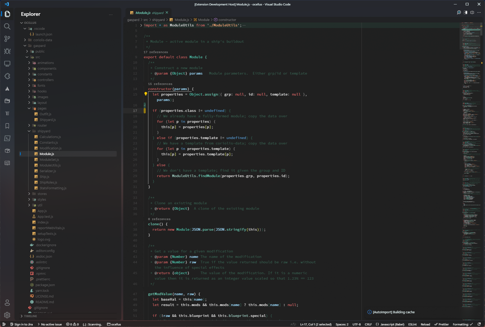
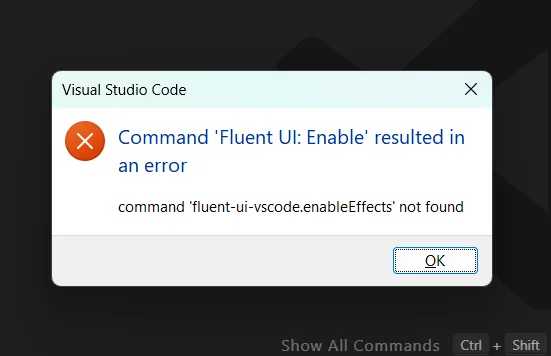

## Welcome

Lo primero que debemos hacer es bajarnos la extensión [fluent UI for VSCode](https://marketplace.visualstudio.com/items?itemName=leandro-rodrigues.fluent-ui-vscode&ssr=false#overview) y instalarla en nuestro VS Code.





# Posibles errores

Esto puede suceder si actualizamos VS Code y no actualizamos la extensión de Fluent UI.




Para solucionar esto, debemos actualizar la extensión de Fluent UI.
[fluent UI for VSCode](https://github.com/Night-Star04/vscode-fluent-ui/releases/tag/v4.3.0)

<Note>
  Debemos desinstalar la extensión actual y volver a instalarla con el .vsix
</Note>


# Funcion en WSL 2

Para que funcione la extensión en WSL 2, debemos agregar el siguiente comando en nuestro archivo .bashrc o .zshrc
 - Instalarlo sin conexion remota (WSL 2)
 Y luego ejecutarlo con el siguiente comando:

```bash
>fluent enabled
```

Luego conectarse al wls
